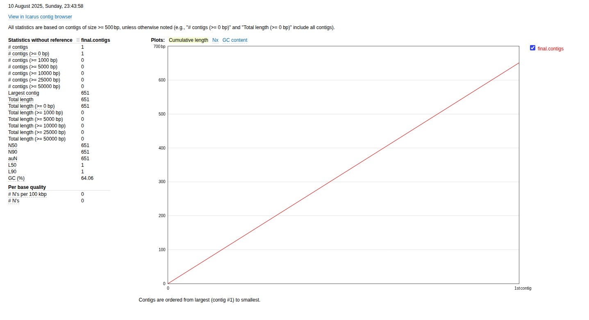
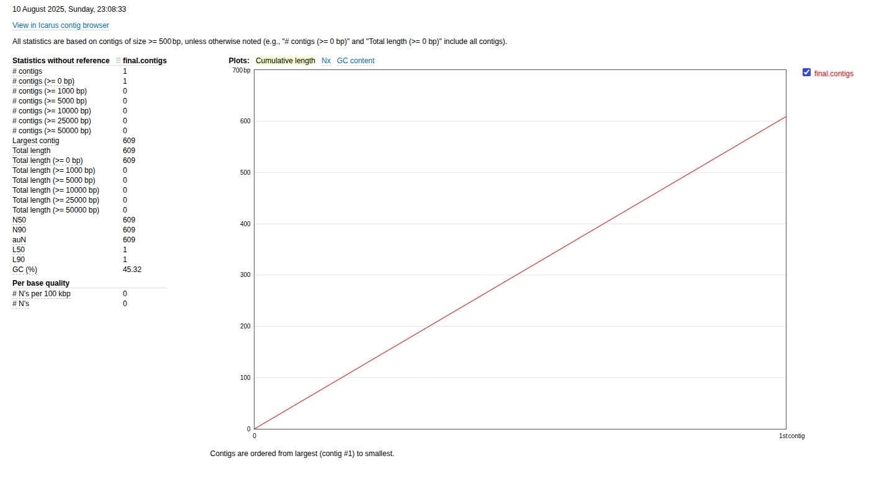

# Google Summer of Code 2025 – Final Report

**Project Title:** Developing Distributed Algorithm for Metagenomic Error Correction and Assembly  
**Contributor:** Gauri D. Ket  
**Mentors:** Arghya Kusum Das, Yali Wang  
**Organization:** University of Alaska Fairbanks Metagenomics Group  

---

## Goals
The project aimed to design and implement a **distributed, scalable metagenomics assembly pipeline** optimized for high-throughput sequencing data.  

Specific objectives were:  
- Build a **distributed algorithm** for metagenomic error correction and assembly.  
- Use **progressive k-mer strategies** and **iterative graph simplification**.  
- Integrate **coverage- and GC-aware clustering** to improve assemblies of GC-rich genomes.  
- Optimize critical routines with **Cython and Dask** for HPC compatibility.  
- Provide reproducible **assembly statistics** and comparisons with state-of-the-art tools.  

---

## What I Did
### 1. Graph Decomposition (`decompose_graph.py`)
- Implemented **k-mer generation** from FASTQ input.  
- Constructed **de Bruijn graphs** annotated with coverage.  
- Designed **coverage-aware clustering** with GC-content refinement.  
- Integrated **paired-end read consistency** for merging clusters.  
- Extracted subgraphs for cluster-level assembly.  

### 2. Contig Formation (`contig_formation.py`)
- Parallelized **tip removal** and **bubble removal**.  
- Implemented **multi-threaded contig construction**.  
- Added **iterative graph simplification cycles** for progressive refinement.  
- Migrated critical functions to **Cython** for speed.  

### 3. Core Pipeline (`main.py`)
- Orchestrated workflow:  
  FASTQ → Graph → Clusters → Error correction → Simplification → Contigs.  
- Added **assembly statistics module** (N50, L50, N90, etc.).  
- Built **timing logger** for profiling runtime at each step.  

### 4. Optimizations
- Cythonized graph utilities (`graph_utils.pyx`).  
- Dask-enabled execution for distributed scalability.  
- Profiling-driven optimization for graph traversal & simplification.  

---

## Current State
- Pipeline works end-to-end: FASTQ → k-mers → graph → clustered subgraphs → contigs.  
- Produces **assembly reports** including per-cluster and overall statistics.  
- Benchmarked successfully against **MEGAHIT** on real datasets.  
- Demonstrated **faster runtime and improved GC recovery** compared to MEGAHIT.  

---

## Results & Comparison
### MEGAHIT vs. My Pipeline
Using a 16S dataset (SRR2628505), we compared core metrics:

| Metric                | Our Pipeline | MEGAHIT |
|------------------------|--------------|---------|
| Largest Contig (bp)   | **651**      | 609     |
| Total Length (bp)     | **651**      | 609     |
| N50 (bp)              | **651**      | 609     |
| GC Content (%)        | **64.06**    | 45.32   |
| # Contigs ≥ 1000 bp   | 0            | 0       |
| Runtime (s)           | **2.92**     | 3.47    |

**Observations**:  
- Higher GC retention.  
- Slightly better contiguity (N50, largest contig).  
- Faster runtime.  

---

### MetaQUAST Results
- My pipeline results.  

- MEGAHIT results.  

---

## Scrapped / Unmerged Work
Not all attempts made it into the final pipeline, but they were valuable learning steps:  

- **Expectation-Maximization (EM) Binning with TNF**  
  - Attempted an EM-based binning module using tetranucleotide frequencies (TNF).  
  - Result: Extremely memory-heavy on large datasets, slow convergence.  
  - Outcome: Dropped from final pipeline, but insights gained for clustering efficiency.  

- **RNN-based Error Substitution**  
  - Experimented with recurrent neural networks to correct sequencing errors.  
  - Will be explored in the future along with LSTMs and LLMs.  

Even though these features were scrapped, they shaped the direction of optimization efforts in the final system.  

---

## What’s Left to Do
- Improve **error correction** with lightweight ML models.  
- Add **bin quality checks** (CheckM, GUNC integration).  
- Scale to **CAMISIM simulated metagenomes** for rigorous benchmarking.  
- Extend to **GPU-accelerated clustering & error correction**.  
- Refine **memory usage** for very large input datasets.  

---

## Challenges
- Designing algorithms that balance **speed, memory, and accuracy**.  
- Debugging **distributed workflows** with Dask across multiple nodes.  
- Avoiding **misassemblies** during graph simplification.  
- Optimizing **Cython extensions** for bottleneck routines.  

---

## Key Learnings
- Importance of **progressive, multi-k strategy** in metagenome assembly.  
- Value of **profiling-driven development** for HPC software.  
- **Trade-offs**: Some ML approaches (RNN, EM binning) can be powerful but impractical without careful engineering.  
- Gained experience bridging **bioinformatics theory with distributed systems engineering**.  

---

## Code & Resources
- **Usage Docs:** [`README.md`](./README.md)  
- **Poster:** *Distributed Iterative Multi-k-mer Metagenome Assembly with Progressive Graph Simplification and GC-Aware Clustering*  
- **MEGAHIT** – Ultra-fast single-node solution for large and complex metagenomics assembly  
  GitHub: [https://github.com/voutcn/megahit](https://github.com/voutcn/megahit)  

- **metaSPAdes** – Versatile assembler for metagenomic data  
  GitHub: [https://github.com/ablab/spades](https://github.com/ablab/spades)  

- **IDBA-UD** – Iterative De Bruijn Graph De Novo Assembler for sequencing data with highly uneven depth  
  GitHub: [https://github.com/loneknightpy/idba](https://github.com/loneknightpy/idba)  

---
